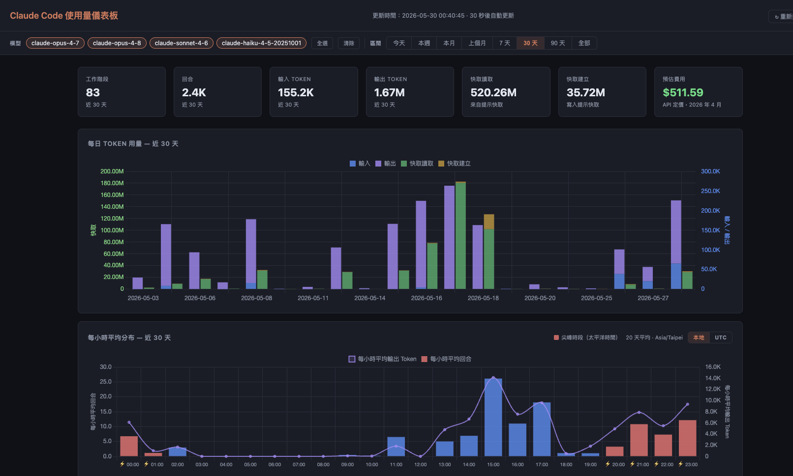

# Claude Code 使用量儀表板（繁體中文版）

[](LICENSE)
[](https://claude.ai/code)
[](#)

> **這是繁體中文（台灣）在地化版本。** 整個網頁儀表板介面已翻譯成繁體中文。原始專案為 [phuryn/claude-usage](https://github.com/phuryn/claude-usage)，由 [The Product Compass Newsletter](https://www.productcompass.pm) 製作；本 fork 僅做介面在地化，核心功能與計算邏輯維持不變。

**Pro 與 Max 訂閱者只能看到一條進度條，這個工具讓你看到完整的使用全貌。**

無論你用的是哪一種方案，Claude Code 都會在本機寫下詳細的使用紀錄——token 數量、模型、工作階段、專案。這個儀表板會讀取這些紀錄，轉換成圖表與費用估算。API、Pro、Max 方案皆適用。



---

## 這個工具追蹤什麼

適用於 **API、Pro、Max 方案**——不論訂閱類型，Claude Code 都會在本機寫下使用紀錄。這個工具讀取那些紀錄，提供 Anthropic 官方介面沒有提供的可視化資訊。

可擷取的使用來源：

- **Claude Code CLI**（終端機中的 `claude` 指令）
- **VS Code 擴充套件**（Claude Code 側邊欄）
- **Dispatched Code 工作階段**（透過 Claude Code 轉送的工作階段）

**無法擷取：**

- **Cowork 工作階段**——這類工作階段在伺服器端執行，不會在本機寫下 JSONL 逐字稿

---

## 系統需求

- Python 3.8 以上
- 不需要任何第三方套件——只用到標準函式庫（`sqlite3`、`http.server`、`json`、`pathlib`）

> 只要你在跑 Claude Code，就一定已經裝好 Python 了。

## 快速開始

不需要 `pip install`、不需要虛擬環境、不需要任何建置步驟。

### macOS / Linux（git clone，建議用此方式取得繁體中文版）

```
git clone https://github.com/joshhu/claude-usage
cd claude-usage
python3 cli.py dashboard
```

### Windows

```
git clone https://github.com/joshhu/claude-usage
cd claude-usage
python cli.py dashboard
```

### macOS / Linux（Homebrew）

```
brew install --formula https://raw.githubusercontent.com/joshhu/claude-usage/main/Formula/claude-usage.rb
claude-usage dashboard
```

安裝完成後，`claude-usage` 指令會加入你的 `PATH`，接受與 `python cli.py` 相同的子指令（`scan`、`today`、`stats`、`dashboard`）。

> 註：Homebrew formula 安裝的程式碼即為本繁體中文 fork，網頁介面同樣是繁體中文。

---

## 使用方式

> 在 macOS／Linux 上，以下指令請把 `python` 換成 `python3`。若你是用 Homebrew 安裝，請把 `python cli.py` 換成 `claude-usage`。

```
# 掃描 JSONL 檔案並寫入資料庫（~/.claude/usage.db）
python cli.py scan

# 在終端機顯示今天的用量摘要（依模型分組）
python cli.py today

# 顯示最近 7 天（每日明細 + 依模型加總）
python cli.py week

# 在終端機顯示歷來統計
python cli.py stats

# 掃描後開啟網頁儀表板 http://localhost:8080
python cli.py dashboard

# 透過環境變數自訂主機與連接埠
HOST=0.0.0.0 PORT=9000 python cli.py dashboard

# 掃描自訂的 projects 目錄
python cli.py scan --projects-dir /path/to/transcripts
```

> 說明：終端機指令（CLI）的輸出維持英文，網頁儀表板介面則為繁體中文。

掃描器採增量更新——它會記錄每個檔案的路徑與修改時間，所以重複執行 `scan` 很快，只會處理新增或變更過的檔案。

預設情況下，掃描器會同時檢查 `~/.claude/projects/` 以及 Xcode 的 Claude 整合目錄（`~/Library/Developer/Xcode/CodingAssistant/ClaudeAgentConfig/projects/`），不存在的目錄會自動略過。若要掃描自訂位置，請使用 `--projects-dir`。

---

## 運作原理

Claude Code 會為每個工作階段在 `~/.claude/projects/` 寫下一個 JSONL 檔案。每一行都是一筆 JSON 紀錄，其中 `assistant` 類型的紀錄包含：

- `message.usage.input_tokens`——原始提示 token
- `message.usage.output_tokens`——生成的 token
- `message.usage.cache_creation_input_tokens`——寫入提示快取的 token
- `message.usage.cache_read_input_tokens`——從提示快取取用的 token
- `message.model`——使用的模型（例如 `claude-sonnet-4-6`）

`scanner.py` 會解析這些檔案，並把資料存進位於 `~/.claude/usage.db` 的 SQLite 資料庫。

`dashboard.py` 會在 `localhost:8080` 提供單頁式儀表板，使用 Chart.js 圖表（從 CDN 載入）。畫面每 30 秒自動更新，支援模型篩選與可加入書籤的網址。綁定位址與連接埠可用 `HOST` 與 `PORT` 環境變數覆寫（預設為 `localhost`、`8080`）。

---

## 費用估算

費用以 **Anthropic API 定價（2026 年 4 月）** 計算（[claude.com/pricing#api](https://claude.com/pricing#api)）。

**費用計算只納入名稱包含 `opus`、`sonnet` 或 `haiku` 的模型。** 本機模型、未知模型，以及任何其他名稱的模型都會被排除（顯示為「不適用」）。

| 模型 | 輸入 | 輸出 | 快取寫入 | 快取讀取 |
|-------|-------|--------|------------|-----------|
| claude-opus-4-7 | $5.00/MTok | $25.00/MTok | $6.25/MTok | $0.50/MTok |
| claude-opus-4-6 | $5.00/MTok | $25.00/MTok | $6.25/MTok | $0.50/MTok |
| claude-sonnet-4-6 | $3.00/MTok | $15.00/MTok | $3.75/MTok | $0.30/MTok |
| claude-haiku-4-5 | $1.00/MTok | $5.00/MTok | $1.25/MTok | $0.10/MTok |

> **注意：** 這些是 API 價格。若你是透過 Max 或 Pro 訂閱使用 Claude Code，實際的費用結構不同（以訂閱計費，而非按 token 計費）。

---

## VS Code 擴充套件

如果你想在編輯器裡看儀表板，同樣的 UI 也以 VS Code 擴充套件的形式提供。相同的資料、相同的圖表，內嵌在活動列側邊欄中。

[**從 VS Code Marketplace 安裝 →**](https://marketplace.visualstudio.com/items?itemName=PawelHuryn.claude-usage-phuryn)


Python 原始碼會打包在 `.vsix` 內，所以使用者端唯一的需求就是 **`PATH` 上有 Python 3.8 以上**。安裝後點選活動列的儀表圖示——伺服器會自動啟動，儀表板會在側邊欄中呈現。

> Marketplace 上架的是原始英文版擴充套件。若要在編輯器中得到繁體中文介面，請改用本 fork 在本機自行安裝（細節見 [vscode-extension/README.md](vscode-extension/README.md)）。

設定、指令、探索順序與本機安裝方式請見 [vscode-extension/README.md](vscode-extension/README.md)。

---

## 檔案說明

| 檔案 | 用途 |
|------|------|
| `scanner.py` | 解析 JSONL 逐字稿，寫入 `~/.claude/usage.db` |
| `dashboard.py` | HTTP 伺服器 + 單頁式 HTML/JS 儀表板（介面已繁體中文化） |
| `cli.py` | `scan`、`today`、`stats`、`dashboard` 等指令 |
| `Formula/claude-usage.rb` | Homebrew formula——以 `brew install --formula <raw-url>` 安裝 |
| `vscode-extension/` | VS Code 擴充套件——把儀表板內嵌到 VS Code 中 |

---

## 在地化說明

本 fork 的翻譯範圍：

- **已翻譯（繁體中文）：** `dashboard.py` 的整個網頁儀表板介面，以及 VS Code 擴充套件內嵌的 webview 狀態面板（`vscode-extension/src/sidebar.ts`）。
- **維持英文：** CLI 終端機輸出、程式碼註解、VS Code 原生指令名稱與通知、CSV 匯出檔的欄位標題（保留為穩定的機器可讀欄名，避免部分試算表軟體出現亂碼）。

---

## 致謝與授權

- 原始專案：[phuryn/claude-usage](https://github.com/phuryn/claude-usage)
- 作者：[The Product Compass Newsletter](https://www.productcompass.pm)
- 授權：MIT（見 [LICENSE](LICENSE)）
